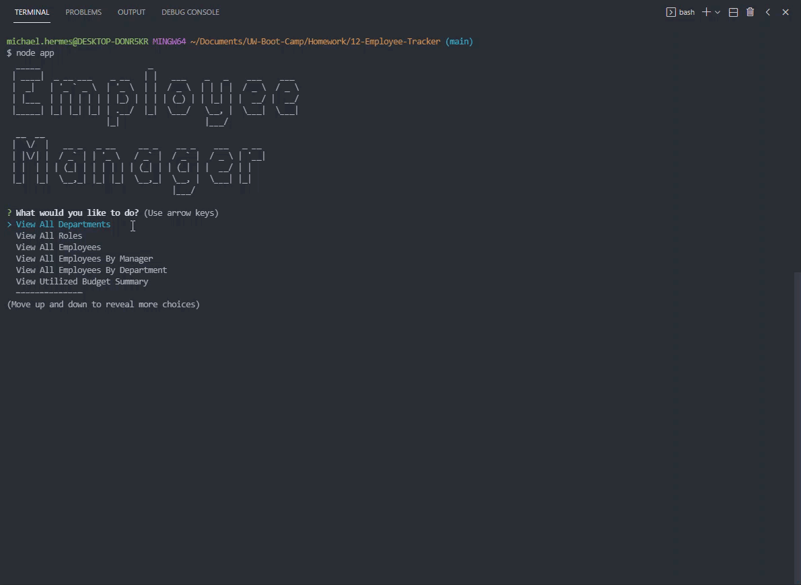

<h1 align="center">Employee Manager</h1>
<h2 align="center">Node.js and MySQL</h2>

## Description

[](http://choosealicense.com/licenses/mit/)

With this application, a user is able to manage their company's Department, Role, and Employee structure. Data is persisted in a local MySQL database.

The application supports Creating, Retrieving, Updating, and Deleting entities in the database. Video walkthroughs of the applications functionality can be found here:

- [Standard](https://www.screencast.com/t/IgaDvln3cl0)
- [Advanced](https://www.screencast.com/t/sooPQZGf)



## User Story

```md
AS A business owner
I WANT to be able to view and manage the departments, roles, and employees in my company
SO THAT I can organize and plan my business
```

## Acceptance Criteria

```md
GIVEN a command-line application that accepts user input
WHEN I start the application
THEN I am presented with the following options: view all departments, view all roles, view all employees, add a department, add a role, add an employee, and update an employee role
WHEN I choose to view all departments
THEN I am presented with a formatted table showing department names and department ids
WHEN I choose to view all roles
THEN I am presented with the job title, role id, the department that role belongs to, and the salary for that role
WHEN I choose to view all employees
THEN I am presented with a formatted table showing employee data, including employee ids, first names, last names, job titles, departments, salaries, and managers that the employees report to
WHEN I choose to add a department
THEN I am prompted to enter the name of the department and that department is added to the database
WHEN I choose to add a role
THEN I am prompted to enter the name, salary, and department for the role and that role is added to the database
WHEN I choose to add an employee
THEN I am prompted to enter the employee’s first name, last name, role, and manager, and that employee is added to the database
WHEN I choose to update an employee role
THEN I am prompted to select an employee to update and their new role and this information is updated in the database
```

## Table of Contents

- [Installation](#installation)
- [Usage](#usage)
- [License](#license)
- [How to Contribute](#how-to-contribute)
- [Questions](#questions)

## Installation

This application makes use of the following Node.js packages:

- [inquirer](https://www.npmjs.com/package/inquirer) for gathering user input
- [mysql2](https://www.npmjs.com/package/mysql2) for executing MySQL database queries
- [console.table](https://www.npmjs.com/package/console.table) for tabular display in the command-line
- [figlet](https://www.npmjs.com/package/figlet) for ASCII Art

Run `npm i` with the included `packages.json` file to install the required packages.

## Usage

Run `node app.js` to begin the application.

The user begins by making a selection from a Main Menu of actions. Depending on the selection, additional input may be required from the user. Once all necessary information is gathered, the database is queried based on the requested action. The user is presented with tabular results of any `SELECT` queries, a confirmation message for any `INSERT`, `UPDATE`, or `DELETE` queries, and is returned to the Main Menu to make an additional selection. The user may select the 'Quit' option from the Main Menu at any time to exit the application.

## License

[](http://choosealicense.com/licenses/mit/)

This application is covered under the MIT license. Information about this license can be found [here](http://choosealicense.com/licenses/mit/).

## How to Contribute

[MichaelHermes](https://github.com/MichaelHermes)

## Questions?

Find me on [Github](https://github.com/MichaelHermes) or email me at [mikehermes87@gmail.com](mailto:mikehermes87@gmail.com).
